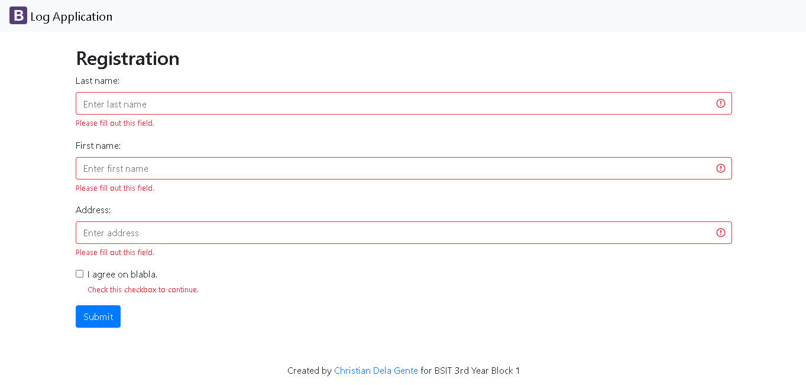
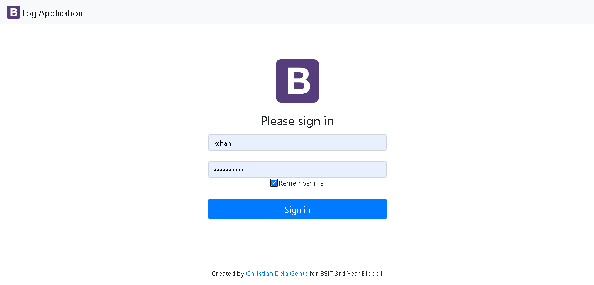
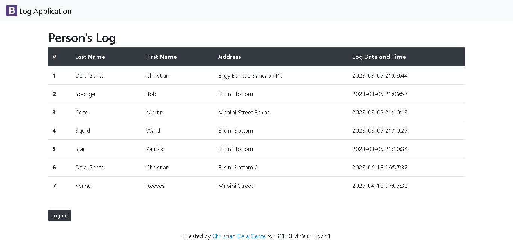

# logApp-scaling-octo

### Log App

**Discription**
This Log App is a system that records the logs of the people that use the app during the pandemic.

To Login, in the Guestbook-Login page. The username is "xchan" and the password is "PogiAko123".

Once logged in, you can view the logs of the people that used the system.

**Installation:**

*Requirements*
1. Php language
2. MySQL or PhpMyAdmin

*Procedure*
1. Open the Log App Scaling Octo folder
2. Import the DelaGente-LogApp.sql to your MySQL or Phpmyadmin
3. On the Log App Scaling Octo folder, open the folder inside it named config, then open the php file named db
4. On the db make a connection from your database to the Log App
5. Once the connection is stablished, you can now open the run the app

**Author:**
Christian Dela Gente

Github: https://github.com/xchan344

